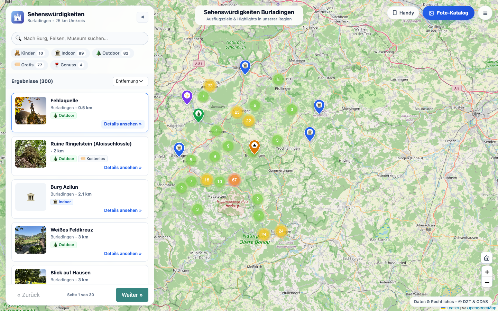
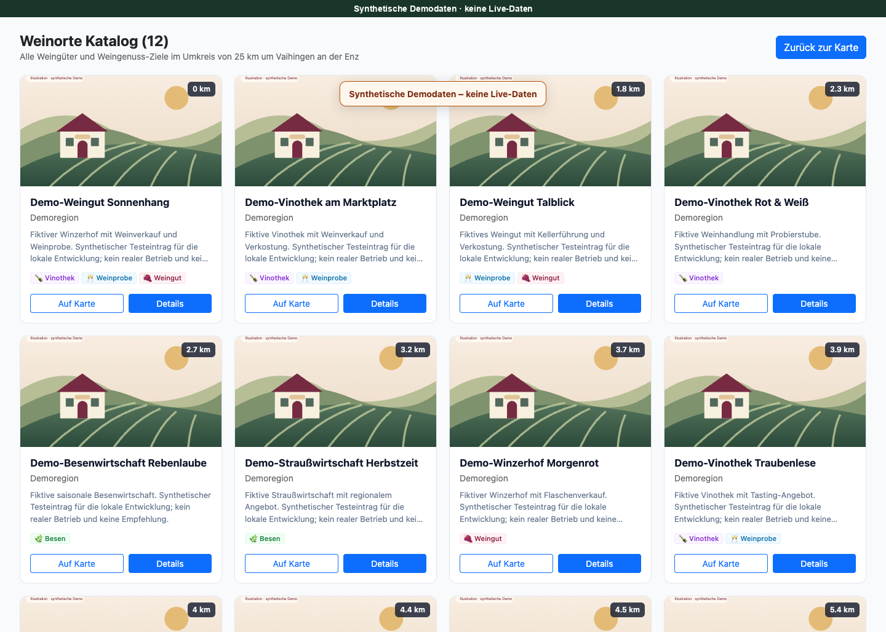
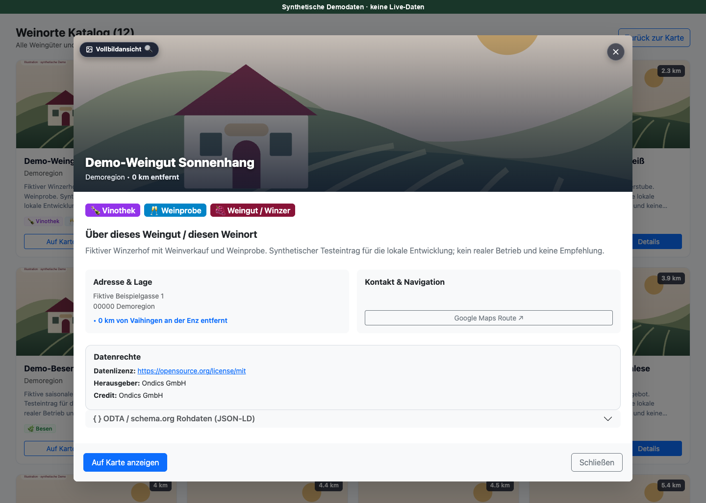
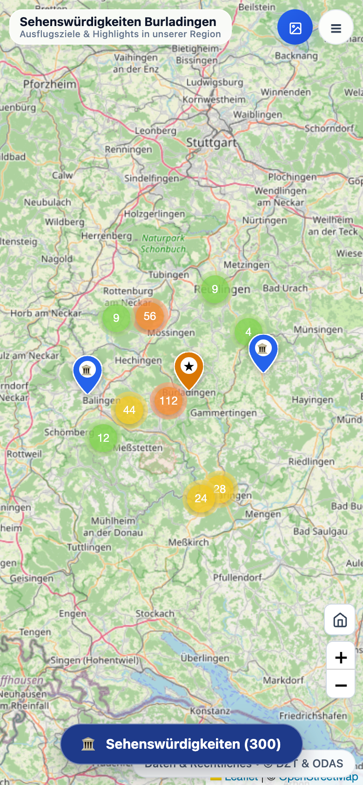
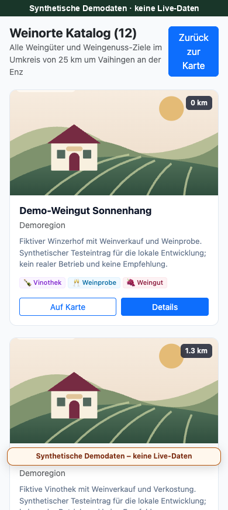
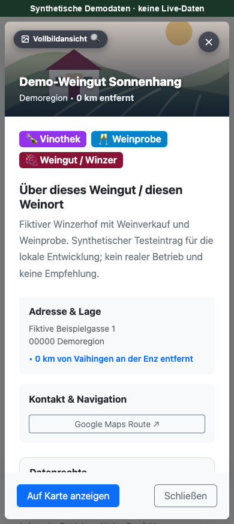

# Weingüter & Weingenuss

**Weingüter & Weingenuss** macht Weinorte aus dem Knowledge Graph der Deutschen Zentrale für Tourismus (DZT) auf einer Karte, in einer filterbaren Liste und in einem Katalog zugänglich.

Die App ist für den [Open Data App Store](https://open-data-app-store.de/) und dessen [Open-Data-App-Spezifikation](https://open-data-apps.github.io/open-data-app-docs/open-data-app-spezifikation/) gemacht. Weitere Apps: [open-data-apps auf GitHub](https://github.com/open-data-apps).

## Für wen ist diese App?

Bürgerinnen, Bürger, Urlaubsgäste und Weininteressierte entdecken regionale Betriebe ohne besondere Datenkenntnisse. Kommunen und Weinregionen legen das Suchgebiet über Ort, Koordinaten und Radius fest.

## Funktionen

- Fullscreen-Karte mit Leaflet, Marker-Clustering, SVG-Pins und Karten-Reset.
- Einklappbares Cockpit mit Textsuche, Sortierung, Kennzahlen und Ergebnisliste.
- Erlebnisfilter für Weingüter, Vinotheken, Besen-/Straußwirtschaften, Weinstuben und Weinproben.
- Katalog für den gesamten **geladenen und gefilterten** Bestand.
- Detaildialog mit Adresse, Beschreibung, Website, Telefon und Wein-/Speisekartenlink, soweit vorhanden.
- Bildgalerie mit getrennten Bild- und Datensatznachweisen; unzureichend belegte Fotos werden nicht angezeigt.
- Quelldatenansicht, Kopieren/Download sowie QR-Code der App-Adresse.
- Mobile Karte/Liste-Umschaltung und ODAS-Seiten für Beschreibung, Kontakt, Datenschutz und Impressum.
- Methodikbereich mit optionalem Datenstand und weiterführenden Links.

## Datenweg und fachliche Grenzen

Die Serverabfrage verwendet ausschließlich **`https://schema.org/Winery`**, keine allgemeine Stichwortsuche nach „Wein“ im gesamten DZT-Bestand.

Die feineren Erlebnis-Kategorien entstehen danach aus **Textheuristiken** in Namen/Beschreibungen. Diese bewusst gewählte Einordnung kann unvollständig oder ungenau sein; sie ist keine amtlich oder vom Betrieb bestätigte Klassifikation.

Pro Abfrage werden höchstens **300 Weinorte** geladen. Karte, Kennzahlen, Filter, Liste und Katalog beziehen sich auf diesen Bestand. Beim Erreichen der Grenze kann es weitere, nicht geladene Betriebe geben; ein kleinerer Radius grenzt die Auswahl ein. Es wird keine Vollständigkeit des regionalen Angebots garantiert.

```text
GET <App-Basispfad>/dzt?path=ts/v1/kg/sparql?query=...
```

Die Runtime verwendet ausschließlich den ODAS-Store-Relay `/dzt`, nicht den allgemeinen `/odp-data`-Proxy und keinen direkten DZT-API-Aufruf. Der Schlüssel bleibt im Store. Authentifizierungs-, Netzwerk- und Formatfehler werden **nicht durch Demo-Betriebe ersetzt**.

Die Datensatzlizenz gilt nicht automatisch für Fotos. Bild-URL, Lizenz und Urheber werden objektbezogen verarbeitet. Die eigene Softwarelizenz ersetzt keine Quellrechte.

## Konfiguration

| Schlüssel | Bedeutung |
|---|---|
| `ort` | Angezeigtes Suchgebiet und Name für die automatische Ortsauflösung. |
| `latitude` / `longitude` | Vollständiges Koordinatenpaar; hat Vorrang vor `ort`. |
| `radiusKm` | `5`, `10`, `25`, `50`, `100` als String; Standard `25`. |
| `standardFilter` | `alle`, `weingut`, `vinothek`, `besen`, `weinstube`, `probe`. |
| `standardSprache` | Bevorzugte Sprache mehrsprachiger Datenfelder: `de` oder `en`; Oberfläche bleibt deutsch. |
| `apiurls` → `dztsparql` | Kanonischer DZT-SPARQL-Endpunkt. Eine leere Quelle löst keinen stillen Defaultabruf aus. |
| `urlDaten` | Datensatz-/Portalseite für die Quellenverlinkung. |
| `bannerTitel`, `bannerUntertitel` | Schwebender Kartenbanner. |
| `kpiKontext1` bis `kpiKontext4` | Erläuterungen der vier Kennzahlen. |
| `datenquelleHinweis` | Methodiktext, im Paket Markdown und zur Laufzeit gerendertes HTML. |
| `datenStand` | Optionaler redaktioneller Stand; leer, wenn nicht bekannt. Abrufzeit ist kein Aktualitätsnachweis der Quelle. |
| `weiterfuehrendeLinks` | Optionaler Markdown-Linkbereich. |
| `titel`, `seitentitel`, `icon` | ODAS-Anzeige-/Brandingwerte. |
| `beschreibung`, `kontakt`, `impressum`, `datenschutz`, `fusszeile` | Inhalte und Betreiberangaben. |
| `brandingCSS`, `brandingCSSFile` | Optionales Instanz-Branding; CSS-Dateilink standardmäßig leer. Bei Bedarf im ODAS-Editor eine vollständige URL eintragen. |

Die wirkungslosen Legacy-Schalter `sprache` und `proxyAktiv` werden nicht mehr angeboten. Es gibt keine versteckten Instanzvariablen `umkreis` oder `demoPois`.

### Ortsauflösung

1. Explizite Betreiberkoordinaten.
2. Lokales Ortsverzeichnis mit **242 Schlüsseln/Aliasnamen**, nicht allen deutschen Gemeinden.
3. Bei Bedarf direkte Ortsabfrage über Nominatim.

**Nur `ort` zu ändern verschiebt das Zentrum nicht, solange die voreingestellten Koordinaten bestehen bleiben.** Für automatische Ortsauflösung beide Koordinatenfelder leeren. Unvollständige/ungültige Koordinaten und nicht auflösbare Orte werden nicht still durch Burladingen oder einen anderen Ort ersetzt.

Ortsauflösungen und DZT-Antworten können in `sessionStorage` gespeichert werden; die DZT-Antwort wird bis zu zwei Stunden wiederverwendet. Sie ist dadurch nicht automatisch zwei Stunden aktuell.

## Lokal starten

Voraussetzungen für Tests: **Node.js 22 oder neuer, Python 3, Make und `zip`**. Docker/Compose nur für den optionalen Containerstart.

### VS Code Live Server

Aus der **Projektwurzel** starten und `http://127.0.0.1:5500/app/` öffnen. Bei anderem Port die aktive Live-Server-Konfiguration beachten. `liveServer.settings.root` bleibt `/`; `app/`, `assets/` und `odas-config/` müssen Geschwisterpfade bleiben. Keine Änderungen an `app-base.js` nötig.

Auf `localhost` und `127.0.0.1` lädt die App ihre **sichtbar gekennzeichneten synthetischen Demodaten** aus `assets/demo-weingueter.json`. Die zwölf Betriebe sind erfunden; die Illustration ist kein Foto eines realen Weinguts. Details: [DEMO-DATA.md](assets/DEMO-DATA.md). Bilder/Kartenkacheln und ein gegebenenfalls nötiger Nominatim-Aufruf sind getrennte Netzwerkzugriffe; „Demo“ bedeutet nicht, dass jede Netzwerkanfrage unterbleibt.

Im Nicht-Loopback-/ODAS-Betrieb werden diese Daten nicht als Ersatz für eine ausgefallene Quelle verwendet.

### Optional mit Docker

```bash
make build up
# http://localhost:8090
make down
```

Der lokale Container stellt keinen eigenen DZT-Relay bereit. Auf localhost wird die synthetische Demo verwendet. Für einen echten DZT-Test ist eine autorisierte ODAS-Testinstanz nötig; keine Schlüssel in den Browser eintragen.

## Tests und Paketbau

Die Menütransition lässt sich mit einer vorhandenen Playwright-/Chrome-Installation zusätzlich prüfen (keine zusätzliche App-Abhängigkeit):

```bash
PLAYWRIGHT_MODULE=/pfad/zur/playwright-installation node --test tests/menu-motion.browser.cjs
```

```bash
make test
make zip
```

`make test` prüft JavaScript-Syntax, echte Runtime-/Sicherheitsregressionen, JSON und die ZIP-Rezeptur in einer temporären Kopie. Es benötigt kein Nachbarrepository. Bei vorhandenem Portfolio-Checkout optional:

```bash
python3 ../tools/odas-config-lint/lint.py .
```

`make check-app` ist ein zusätzlicher ODAS-Tools-Aufruf und benötigt separat `../odas-tools/app-check.sh`.

`make zip` baut jedes Mal ein **frisches** `oda-weingueter.zip`; entfernte Quelldateien bleiben nicht im Archiv zurück. Inhalt: `app/`, `assets/`, `app-package.json`, `CHANGELOG.md`, `LICENSE`. Tests, Entwicklungswerkzeuge, lokale Config und historische Nachweise sind nicht im ZIP. Das ZIP ist ein ignoriertes Bauartefakt, kein Git-Bestandteil.

## Beim Aufruf kontaktierte Drittanbieter

Alle Programmbibliotheken werden aus `app/vendor/` ausgeliefert, ohne CDN-Anfragen.

- DZT: Browserabruf über den serverseitigen `/dzt`-Relay der App-Instanz; kein direkter DZT-API-Aufruf.
- `*.tile.openstreetmap.org`: direkte Kartenkacheln; der Dienst erhält IP-Adresse und technische Verbindungsangaben.
- Bildhosts der freigegebenen DZT-Fotos: direkte automatische Bildabrufe; entsprechende Verbindungsdaten gehen an den jeweiligen Bildanbieter. Konkrete Bild-/Quellverweise stehen am Nachweis.
- `nominatim.openstreetmap.org`: nur ohne Betreiberkoordinaten und bei lokal unbekanntem Ort; übertragen werden der konfigurierte Ortsname und technische Verbindungsdaten.
- Google Maps/Betriebswebsites: erst nach Linkklick. Telefonlinks: erst nach Nutzeraktion.

Die App verwendet kein Tracking und fragt keinen GPS-Standort ab. Browser-Sitzungsspeicherung und externe Verbindungen sind oben beschrieben; ergänzend gelten die Angaben des jeweiligen Portalbetreibers. Eine pauschale Garantie „keine Datenübertragung an Dritte“ wird nicht gegeben.

## Screenshots

Die sechs Store-Bilder zeigen die Oberfläche mit **gekennzeichneten synthetischen Demodaten**; sie sind kein Live-Abnahmenachweis.

| Ansicht | Übersicht | Katalog | Detail |
|---|---|---|---|
| Desktop |  |  |  |
| Mobile |  |  |  |

[Bildnachweise](assets/SCREENSHOTS.md).

Historischer [Prüfnachweis zum Runtime-Stand 1.0.3](tests/evidence/release-readiness-2026-10-08.md), erstellt vor den späteren Paketupdates und kein Beleg für die aktuellen Screenshots. Version 1.0.4 korrigierte ausschließlich die optionale Branding-CSS-Vorbelegung für den ODAS-Editor; Version 1.0.5 aktualisiert ausschließlich Screenshots und Metadaten.

## Wichtige Dateien und Versionsstand

| Pfad | Inhalt |
|---|---|
| `app/app.js`, `app/app.css` | DZT-Datenweg und Weinoberfläche |
| `app/app-base.*`, `app/index.html` | Unveränderte ODAS-Runtime |
| `app/vendor/` | Benötigte Bibliotheken und Lizenztexte |
| `assets/schema.json` | Normalisiertes Darstellungsmodell, nicht die rohe SPARQL-Antwort |
| `assets/gemeinden.json` | Begrenztes lokales Ortsverzeichnis |
| `assets/demo-weingueter.json`, `assets/demo-weingueter.svg` | Eigene synthetische lokale Demo |
| `odas-config/config.json` | Lokaler Konfigurationsspiegel mit gerendertem HTML |
| `tests/`, `tools/test-package.py` | Runtime-/Sicherheitsregressionen und Paketbautest |

App-Version **1.0.6** (native Menüanimation und Berücksichtigung reduzierter Bewegung), ODAS-Paketformat **2**, Config-API **1**, Dienst `tourismus-odg`.

Vorgesehener Repositorypfad: [open-data-apps/oda-weingueter](https://github.com/open-data-apps/oda-weingueter). Erstellen/Pushen des öffentlichen Repositories ist ein eigener Veröffentlichungsschritt. Historische Dev-Portal-Tests ersetzen keine Prüfung einer später geänderten Version.

## Lizenz

Eigener App-Code und die eigens erstellte synthetische Demo: **MIT**, © 2026 Ondics GmbH, siehe [LICENSE](LICENSE). Fremdbibliotheken: [THIRD-PARTY.md](app/vendor/THIRD-PARTY.md). DZT-Datensätze und Fotos behalten ihre jeweiligen Quellrechte; sie werden nicht durch die MIT-Lizenz dieser App neu lizenziert.
